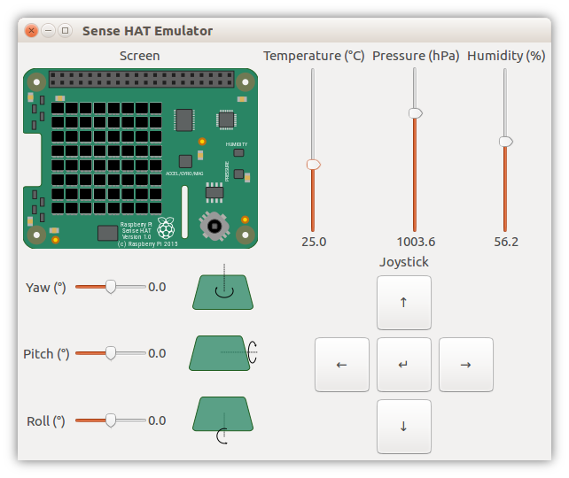
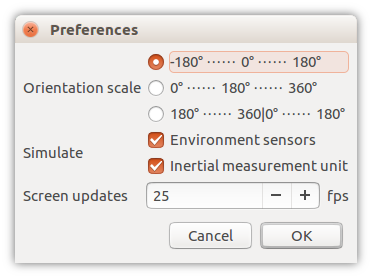

.. _sense_emu_gui:

==============
Sense Emulator
==============

The Sense HAT emulator application. This GTK application provides an
interactive interface for emulating the Raspberry Pi Sense HAT.

Synopsis
========

::

    sense_emu_gui

Usage
=====

The main window is divided into four parts. At the top left is a visual
representation of the Sense HAT. Scripts using the emulator library
(:mod:`sense_emu`) to set the HAT's LEDs will display the result here.
Immediately below the LEDs are the rotation buttons which rotate the view of
the HAT. These buttons also affect the action of the joystick buttons (covered
below).

At the top right, three sliders represent the temperature, pressure, and
humidity of the emulated HAT's environment.

.. note::

    The emulation does not *precisely* reflect the settings of the temperature,
    pressure, and humidity sliders. Random errors are introduced that scale
    according to the sensor specifications, and as the sliders are adjusted,
    the sensor value will gradually drift towards the new setting at a similar
    rate to the sensors on the real HAT.

At the bottom right of the window, a series of buttons are provided to emulate
the joystick on the HAT. The buttons will simulate *press*, *release*, and
*hold* events generated by the real joystick. When the view of the HAT is
rotated, the joystick buttons will act in the new orientation of the HAT. For
example, initially the "up" button will send "up" events. After the HAT is
rotated 90° the "up" button will send "right" events. After another 90°
rotation, the "up" button will send "down" events, and so on.

Finally, at the bottom left of the window, three sliders provide the
orientation of the emulated HAT in terms of yaw (rotation around the vertical Z
axis), pitch (rotation around the Y axis), and roll (rotation around the X
axis). Adjusting these sliders affect the accelerometer, gyroscope, and
magnetometer (compass) sensors on the emulated HAT. The emulated HAT assumes
gravity runs vertically in the direction of the Z axis (as in the real HAT),
and that North is in the direction of the X axis.

.. note::

    The emulator must be run prior to starting any scripts which expect to use
    the :mod:`sense_emu` library. However, the emulator can be terminated (and
    restarted) while scripts using the library are running (obviously, when the
    emulator isn't running sensor errors can't be emulated and all sensor
    readings will appear fixed). Attempting to spawn more than one instance of
    the emulator will simply activate the existing instance.

Preferences
===========

On slower Pis in particular, you may wish to disable some aspects of the
emulation for performance purposes. From the "Edit" menu, select "Preferences".
In the window that appears you can control which aspects of the emulation are
enabled, and what speed the screen updates will be limited to.

You can also control the appearance of angles for the orientation sliders (note
that this is a purely visual preference; it doesn't affect the output of the
emulated sensors in any way).

Replay
======

Recordings of actual sensor readings from a Sense HAT can be replayed within
the emulator. From the "File" menu, select "Replay recording". From the file
selection dialog that appears, select the recording you wish to replay and
click "Open".  The replay will immediately begin, with progress displayed in a
bar at the bottom of the main window. You can click "Stop" (next to the
progress bar) to terminate playback of the recording.

.. image:: gui_replay.png
    :align: center

During playback, the sensor sliders will move according to the data in the
recording but will be disabled (to prevent the user affecting the replay). At
the end of the replay (or immediately after termination of playback), the
sliders will be left at their present positions and re-enabled.
